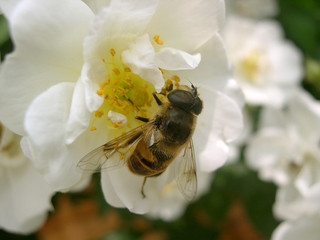
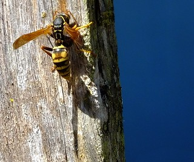
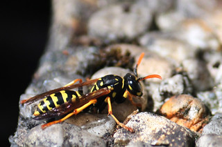

# Bees vs Wasps

## Synopsis

Hand-curated, close-up photos of `bees`, `wasps`, and `other` insects. The challenge is primarily to distinguish bees from wasps. 


example bees:




example wasps:






example other insect:


example other non-insect:


### Excerpt from `labels.csv` :

```
id,path,is_bee,is_wasp,is_otherinsect,is_other,photo_quality,is_validation,is_final_validation
1,bee1\10007154554_026417cfd0_n.jpg,1,0,0,0,1,0,0
2,bee1\10024864894_6dc54d4b34_n.jpg,1,0,0,0,1,0,1
3,bee1\10092043833_7306dfd1f0_n.jpg,1,0,0,0,1,1,0
6842,wasp2\I00101.jpg,0,1,0,0,0,0,0
6843,wasp2\I00102.jpg,0,1,0,0,0,0,0
6844,wasp2\I00103.jpg,0,1,0,0,0,1,0
```

### Dataset totals

```
we have:
 bees..........: 3183
 wasps.........: 4943
 other insects.: 2453
 other.........: 845

in that, there is:
 training photos : 7942
 hyperparameter tuning (1st level validation) photos : 1719
 final validation (brag about your result with these) photos : 1763

In the final validation, there is 504 bees and 753 wasps, meaning that the resolution of the result is 0.08%
```


## Labels:

in `labels.csv` : 

* `id` - ordinal - unique index
* `path` - string - relative path to the photo, including extension
* `is_bee` - nominal - 1 if there is a bee in the photo
* `is_wasp` - nominal - 1 if there is a wasp in the photo
* `is_otherinsect` - nominal - 1 if there is other insect prominently in the centre of the photo, but it is not a wasp and not a bee. It might be a fly, but there are other things there too, like beetles
* `is_other` - random photos not containing any insects
* `photo_quality` - 1 for photos where I have very high confidence that it is bee, wasp, or other. 0 for photos of generally low quality or where I am not very confident that it is what it says it is. You can use this to initially reduce the size of the training set
* `is_validation` - you can use this for your training validation, or you can combine these with the training data and split your training/validation differently
* `is_final_validation` - do NOT use these photos for training - use them to compute your final score. This will enable comparing results by different kagglers. Optionally, if you want to deploy an app to actually serve the model, you can then use these for final training too.


## Credits

This image dataset collates and refines upon several sources:

* "PollenDataset" by 2017 Ivan Rodriguez, Rémi Mégret, Edgar Acuña, José Agosto, Tugrul Giray, from https://www.kaggle.com/ivanfel/honey-bee-pollen

* https://www.kaggle.com/tegwyntwmffat/european-wasp-vespula-vulgaris-kitti-format/  - there isn't any shorter description
* Flicker search for bee, wasp and fly


The photos have been hand-curated by our expert biologist, **Callum Robertson** https://www.linkedin.com/in/callum-robertson-358014109/

Collator and Kaggle competitor: George Rey https://www.linkedin.com/in/dr-george-rey-dziewierz/

​	

---

Contributions:

Ivan Rodriguez, Rémi Mégret, Edgar Acuña, José Agosto, Tugrul Giray. _Recognition of pollen-bearing bees from Video using Convolutional Neural Network_, IEEE Winter Conf. on Applications of Computer Vision, 2018, Lake Tahoe, NV. https://doi.org/10.1109/WACV.2018.00041

